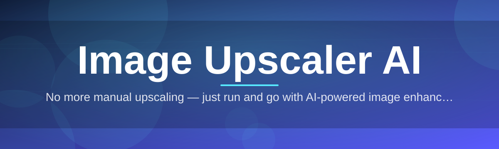
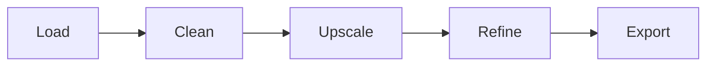

# image-upscaler-ai-enhancer 🖼️⚡

  

*Pixels in, resolution up, quality untouched — upscaling that respects your image instead of guessing at it.*

  

---

## 🔍 Overview

**TL;DR:** A standalone Windows app that turns small, soft, or compressed images into sharp, high-resolution versions using neural upscaling — no subscriptions, no cloud round-trips, no watermarks.

Every image has a ceiling. Screenshots get blurry when stretched. Old photos lose detail when scanned at low DPI. Product shots shrink into mush the moment a client asks for a "just a bit bigger" version. Traditional resizing — bicubic, bilinear, nearest-neighbor — just repeats pixels; it doesn't *know* what a face, a texture, or an edge is supposed to look like. **image-upscaler-ai-enhancer** exists because resizing and upscaling are not the same problem, and treating them as one is why so many "enlarged" images still look soft and lifeless.

This tool is built for photographers cleaning up archives, e-commerce sellers who need crisp product photography, game artists upscaling textures, designers rescuing low-res assets from old projects, and anyone who has ever zoomed into a photo and winced. It runs entirely on your machine — your images never leave your device — and it's tuned specifically for the messy reality of real-world images: noise, JPEG artifacts, motion blur, and inconsistent lighting.

The Image Upscaler AI engine inside this project uses a trained super-resolution model to reconstruct plausible detail rather than merely stretching pixels. The result is enlargement that looks like it was *shot* at higher resolution, not *scaled* to one.

---

## 🚀 What It Actually Does

**TL;DR:** Nine capabilities, each solving a specific upscaling headache — not a generic filter dump.

- **Neural super-resolution upscaling** — reconstructs realistic detail at 2x, 4x, and 8x scale instead of blurring pixels apart.

- **Face-aware enhancement** — detects portraits and applies dedicated detail recovery to eyes, skin texture, and hair strands.

- **Batch processing pipeline** — drop in a folder of hundreds of images and walk away; the queue handles the rest.

- **Noise and artifact suppression** — cleans JPEG compression blocks and sensor grain before upscaling, so you're not sharpening noise.

- **Format-flexible output** — export as PNG, JPEG, or WebP, with lossless options for archival work.

- **Before/after live preview** — a draggable split-view slider so you see exactly what the model changed, in real time.

- **Custom model profiles** — swap between models tuned for photos, anime/illustration art, or pixel-art textures.

- **Offline-first processing** — every operation runs locally on your GPU or CPU; nothing is uploaded anywhere.

- **Non-destructive workflow** — originals are never overwritten unless you explicitly choose to.

> [!TIP]
> Running a mixed batch of photos and illustrations? Switch model profiles mid-queue — the app applies the right model per image automatically if auto-detect is enabled.

---

## 🧭 Getting Started — Step by Step

**TL;DR:** Visit the landing page, download, run the installer, upscale your first image in under two minutes.

1. **Visit the landing page.** Click the download button below — it's the only official source for this tool.

2. **Download the installer.** Grab the latest Windows build; no account, no email, no sign-up wall.

3. **Run it.** Launch the executable, accept the standard Windows prompt, and let setup finish — it takes seconds.

4. **Drop in an image.** Drag a photo onto the window, pick your scale factor, hit **Enhance**, and watch it resolve.

> [!NOTE]
> First launch may take a moment longer while the app initializes its local model cache. This only happens once.

---

## 💻 System Requirements

**TL;DR:** Windows 10/11, no installs of anything else, works with or without a dedicated GPU.

| Component | Minimum | Recommended |
|---|---|---|
| OS | Windows 10 (64-bit) | Windows 11 (64-bit) |
| RAM | 4 GB | 16 GB |
| GPU | None (CPU mode) | Dedicated GPU with 4 GB+ VRAM |
| Storage | 500 MB free | 2 GB free (for batch caching) |
| Dependencies | None — fully standalone | None |

> [!IMPORTANT]
> This is a standalone application. There is nothing to configure at the system level, no runtimes to install separately, and no background services left behind.

---

## ⚙️ How It Works

**TL;DR:** Load image → clean it → upscale with the neural model → refine detail → export. Five stages, one pipeline.

The enhancement pipeline is deliberately linear so results stay predictable and reproducible:

1. **Ingest** — the image is decoded and analyzed for resolution, noise level, and content type (photo vs. illustration).

2. **Pre-clean** — compression artifacts and sensor noise are suppressed before any upscaling happens, so the model isn't amplifying garbage.

3. **Super-resolve** — the core neural network reconstructs missing detail at the target scale factor.

4. **Refine** — a secondary pass sharpens edges and stabilizes color without introducing halos or oversharpening artifacts.

5. **Export** — the final image is written out in your chosen format, at your chosen quality.

---

## 🛠️ Troubleshooting

**TL;DR:** Most issues trace back to GPU drivers, huge batch sizes, or unusual source formats.

<strong>The app runs slowly on my machine — is something wrong?</strong>

Not necessarily. Without a dedicated GPU, the app falls back to CPU processing, which is inherently slower for large images or high scale factors. Try reducing scale to 2x first, or process smaller batches.

<strong>Upscaled faces look slightly waxy or over-smoothed.</strong>

This usually happens when face-aware enhancement is set too aggressively on already-sharp source images. Lower the enhancement strength slider or switch to the general-purpose model profile.

<strong>My image has visible banding after upscaling.</strong>

Source images with heavy prior compression sometimes carry banding into the output. Enable the pre-clean noise suppression pass — it's on by default but may have been disabled in a custom profile.

<strong>Batch processing stopped partway through.</strong>

Check available disk space — large batches at 4x/8x scale generate sizable output files. The queue resumes from the last completed image if you restart the job.

<strong>Can I upscale anime or pixel art without it looking blurry?</strong>

Yes — switch the model profile to the illustration-tuned model before processing. The default photo model is not optimized for flat color regions and hard line art.

<strong>Does this tool send my images anywhere?</strong>

No. Every processing stage happens locally on your machine. There is no upload step in the pipeline.

---

## 🎛️ Interface, Shortcuts & Personalization

**TL;DR:** A dark-by-default UI with a full light theme, keyboard-first workflow, and per-project settings memory.

**Keyboard shortcuts:**

| Action | Shortcut |
|---|---|
| Open image | `Ctrl + O` |
| Batch import folder | `Ctrl + Shift + O` |
| Run enhancement | `Ctrl + Enter` |
| Toggle before/after view | `Space` |
| Export current image | `Ctrl + S` |
| Cycle model profile | `Tab` |

**Themes:** Dark (default), Light, and High-Contrast — switchable from Settings without restarting.

**Settings persistence:** scale factor, model profile, and output format are remembered per session, so repeat workflows don't require reconfiguration.

> [!TIP]
> Hold `Alt` while dragging the before/after slider for fine, pixel-level comparison instead of coarse dragging.

---

## 🤝 Contributing & Community

**TL;DR:** Issues, feature requests, and pull requests are welcome — this project grows with its users.

Found a bug in a specific model profile? Have an idea for a new export format? Open an issue. Want to improve documentation or add a troubleshooting entry from your own experience? Pull requests are reviewed regularly.

- Report bugs with clear reproduction steps and sample images when possible.

- Suggest features that solve a real workflow problem, not just "add more sliders."

- Star the repo if this tool saved you time — it genuinely helps visibility.

  

> [!WARNING]
> This repository does not distribute this application through any channel other than the official landing page linked in this README. Be cautious of copies hosted elsewhere.

---

## 📄 License

**TL;DR:** MIT, 2026. Use it, modify it, ship it — just keep the license notice.

This project is released under the [MIT License](LICENSE). Do what you want with it, commercially or otherwise, as long as the license terms travel with it.

---

## ⚠️ Disclaimer

**TL;DR:** Output quality depends on your source image — this tool enhances, it doesn't invent miracles.

Image Upscaler AI reconstructs plausible detail based on trained model patterns; it does not recover information that was never captured. Extremely low-quality or heavily compressed sources will improve, but will not become studio-grade photography. Results vary by content type, scale factor, and hardware. This software is provided "as is," without warranty of any kind, in accordance with the MIT License.

